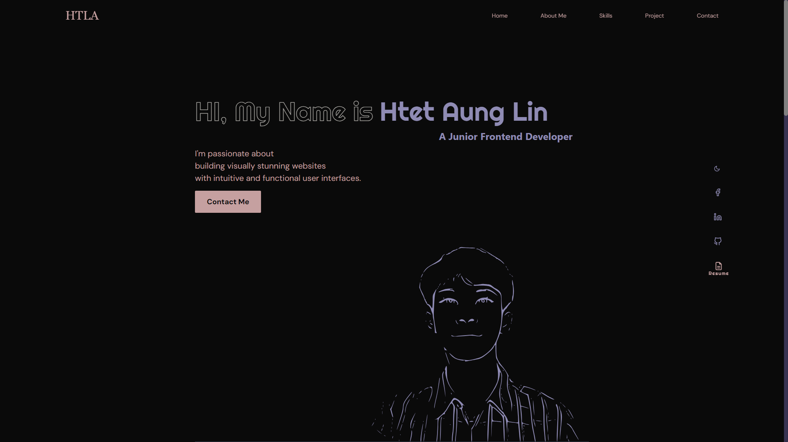

# My Personal Portfolio Website
My Portfolio website is  developed for the purpose of showcasing my skills and experiences.

## Technologies Used

- React
- TailwindCss
- Framer Motion

## Installation

1. Clone the repository.

   ```bash
   git clone https://github.com/HTLA380/Personal_Portfolio.git
   cd Personal_Portfolio
   npm install
   ```

## Usage

2. To run the development server, use the following command:

```bash
npm run dev
```

## ScreenShot



## Live URL

- [htetaunglin-coder](https://htetaunglin-coder.netlify.app/)
