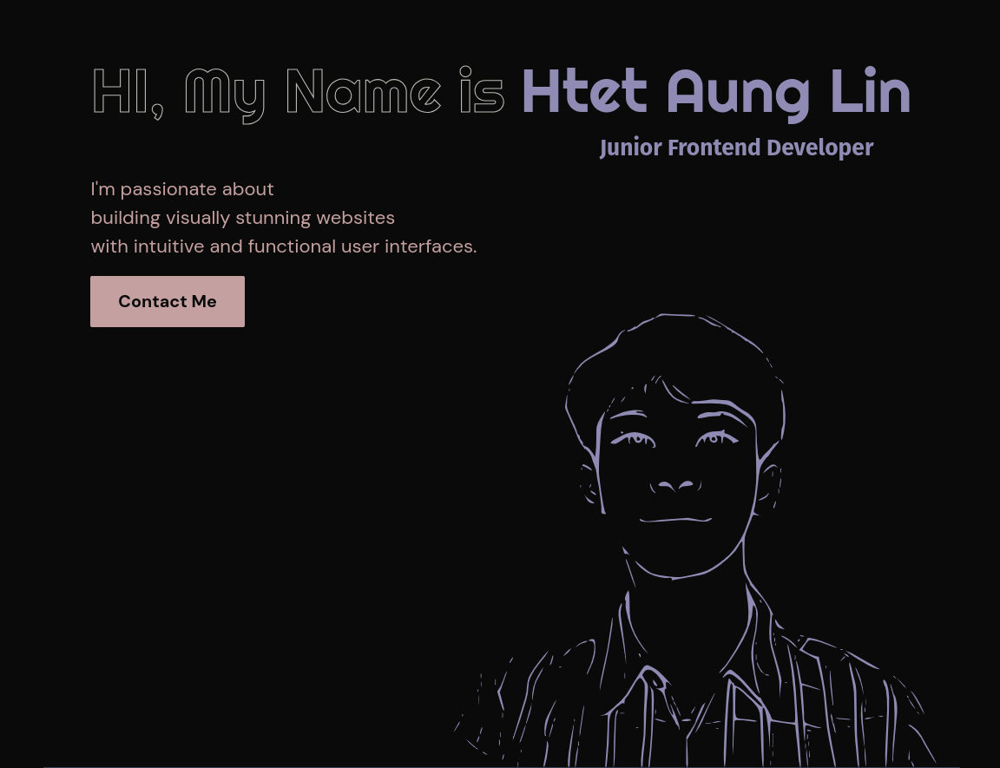

# Htet Aung Lin's Personal Portfolio

This is the personal portfolio website of me. It showcases my projects, skills, and provides a way to contact me. The website is built using Next.js, TypeScript, and Framer Motion for animations.

## Technologies Used

-   **Next.js**: A React framework for building server-side rendered applications.
-   **TypeScript**: A statically typed superset of JavaScript.
-   **Framer Motion**: A library for animations in React.

## Setup and Installation

To run this project locally, follow these steps:

### Prerequisites

-   Node.js (version 14.x or later)
-   npm (version 6.x or later) or yarn (version 1.x or later)

### Installation

1.  **Clone the repository**:
   
    ```
     git clone https://github.com/HTLA380/Personal_Portfolio.git
     cd Personal_Portfolio
    ``` 
    
2.  **Install dependencies**:
    
    ```
	 npm install
	 # or
	 yarn install
    ```   
    
3.  **Set up environment variables**:
    
    Create a `.env.local` file in the root directory and add your EmailJS secrets:
    

		NEXT_PUBLIC_EMAILJS_SERVICE_ID=your_service_id
		NEXT_PUBLIC_EMAILJS_TEMPLATE_ID=your_template_id
		NEXT_PUBLIC_EMAILJS_USER_ID=your_user_id
    
 

### Running the Project

To start the development server, run:

	 npm run dev
	 # or
	 yarn dev

Open http://localhost:3000 to view it in the browser.

### Project Structure

```
src
├── app
│   ├── (index)
│   │   ├── layout.tsx
│   │   └── page.tsx
│   ├── css
│   │   ├── animation.css
│   │   ├── fonts.css
│   │   ├── globals.css
│   │   ├── loading.css
│   │   └── util.css
│   ├── error.tsx
│   ├── layout.tsx
│   ├── loading.tsx
│   ├── not-found.tsx
│   ├── projects
│   │   └── page.tsx
│   ├── providers.tsx
│   └── resume
│       └── page.tsx
├── components
│   ├── animation
│   │   ├── AnimateDiv.tsx
│   │   ├── AnimatePresenceWrapper.tsx
│   │   ├── TextReveal.tsx
│   │   └── Transition.tsx
│   ├── footer
│   │   └── Footer.tsx
│   ├── navbar
│   │   ├── DesktopNavMenu.tsx
│   │   ├── MobileNavMenu.tsx
│   │   └── Navbar.tsx
│   ├── rightbar
│   │   └── RightBar.tsx
│   ├── sectionTitle
│   │   └── SectionTitle.tsx
│   ├── toggletheme
│   │   └── ToggleTheme.tsx
│   └── tooltip
│       └── Tooltip.tsx
├── containers
│   ├── home-page
│   │   ├── _data
│   │   │   ├── about-me-data.json
│   │   │   ├── hero-section-data.json
│   │   │   ├── project-data.json
│   │   │   └── skill-data.json
│   │   ├── about-me-section
│   │   │   ├── DesktopView.tsx
│   │   │   ├── MobileView.tsx
│   │   │   └── index.tsx
│   │   ├── contact-section
│   │   │   ├── ContactForm.tsx
│   │   │   ├── index.tsx
│   │   │   └── messageSchema.ts
│   │   ├── hero-section
│   │   │   └── index.tsx
│   │   ├── project-section
│   │   │   └── index.tsx
│   │   └── skills-section
│   │       ├── DesktopView.tsx
│   │       ├── MobileView.tsx
│   │       └── index.tsx
│   └── project-page
│       ├── _data
│       │   └── projects-data.json
│       └── project-showcase-section
│           ├── EachProject.tsx
│           └── index.tsx
└── hooks
    └── useMediaQuery.tsx    
```

## ScreenShot



## Live URL

- [htetaunglin-coder](https://htetaunglin-coder.vercel.app/)
